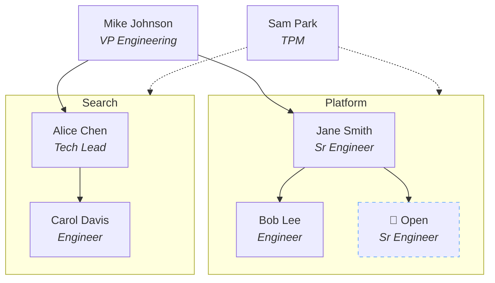
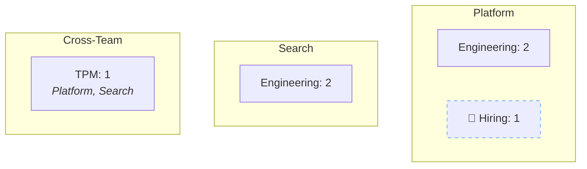

# Orgchart CLI — Design Spec

## Overview

A Go CLI tool that reads a spreadsheet (`.xlsx` or `.csv`) of people in an organization and outputs mermaid flowchart diagrams. Compiles to a single binary with no runtime dependencies. It supports multiple views of the same data and handles cross-team ownership, multi-team managers, and open headcount.

## Input Format

Spreadsheet with one row per person and the following columns:

| Column | Required | Description |
|--------|----------|-------------|
| Name | Yes | Person's name (primary key for manager references). For open headcount, use a placeholder like "Open - Sr Engineer". |
| Role | Yes | Title/role (e.g., "Senior Engineer", "TPM") |
| Discipline | Yes | Functional discipline (e.g., Engineering, Design, PM, TPM) |
| Manager | No | Name of this person's manager. Must match another row's Name. Blank = org root. |
| Team | Yes | Primary team name |
| Additional Teams | No | Comma-separated list of other teams this person has ownership in |
| Status | Yes | One of: `Active`, `Hiring`, `Open` |

Accepted file formats: `.xlsx` (via excelize) and `.csv` (via stdlib encoding/csv). Detected by file extension.

## CLI Interface

```
orgchart people <file> [-o output.md]
orgchart headcount <file> [-o output.md]
```

- `<file>` — path to input spreadsheet
- `-o` — optional output file path; defaults to stdout
- Errors and validation failures go to stderr with row numbers

Built with `cobra`.

## Architecture

Pipeline architecture with four stages:

```
cmd/ → parser.go → model.Org → views/ → renderer.go → stdout/file
```

### Module Structure

```
orgchart/
├── cmd/
│   ├── root.go         # Cobra root command
│   ├── people.go       # People subcommand
│   └── headcount.go    # Headcount subcommand
├── internal/
│   ├── model/
│   │   └── model.go    # Person, Org structs
│   ├── parser/
│   │   └── parser.go   # Read .xlsx/.csv → Org
│   ├── views/
│   │   ├── people.go   # Names + roles view
│   │   ├── headcount.go# Discipline counts view
│   │   └── viewmodel.go# Shared view model types
│   └── renderer/
│       └── renderer.go # View model → mermaid string
├── main.go
├── go.mod
└── go.sum
```

### Data Model

```go
type Person struct {
    Name            string
    Role            string
    Discipline      string   // Engineering, Design, PM, TPM, etc.
    Manager         string   // Name ref (empty = top of tree)
    Team            string   // Primary team
    AdditionalTeams []string // Cross-team ownership
    Status          string   // Active | Hiring | Open
}

type Org struct {
    People    []Person
    ByName    map[string]*Person
    ByTeam    map[string][]*Person
    ByManager map[string][]*Person
    Roots     []*Person // People with no manager
}
```

The `Org` struct pre-computes lookup maps via a constructor function `NewOrg(people []Person) (*Org, error)` which also performs validation. Views consume these lookups rather than re-scanning the people slice.

### Node ID Generation

Node IDs are derived from names: lowercased, spaces replaced with underscores, non-alphanumeric characters stripped. For Open/Hiring rows, IDs are generated as `open_1`, `open_2`, etc. (sequential counter). Collisions (two people whose names produce the same ID) are resolved by appending `_2`, `_3`, etc.

### View Model

Views are functions that take an `*Org` and return a view model — a data structure describing nodes and edges to draw. The renderer takes the view model and emits mermaid syntax.

```go
type Node struct {
    ID    string
    Label string
    Class string // e.g., "hiring"
}

type Edge struct {
    From   string
    To     string
    Dotted bool
}

type Subgraph struct {
    Label string
    Nodes []Node
}

type ViewModel struct {
    Subgraphs  []Subgraph
    FreeNodes  []Node      // Nodes outside subgraphs (e.g., org roots)
    Edges      []Edge
    ClassDefs  []string    // Raw classDef lines
}
```

This separation means:
- Views don't know about mermaid syntax
- Renderer doesn't know about org logic
- Both are independently testable

### Renderer

The renderer takes a `ViewModel` and produces a mermaid `flowchart TD` string. It handles:
- Subgraphs for teams
- Node labels (with HTML-like formatting for name/role)
- Solid edges for reporting lines
- Dotted edges for cross-team ownership
- CSS class definitions for styling (e.g., dashed borders for hiring)

## Views

### People View (`orgchart people`)

Every person is a node showing their name and role. Structure:

- **Teams as subgraphs** — each team is a labeled subgraph containing its members
- **Solid arrows** — reporting lines (manager → report)
- **Dotted arrows** — cross-team ownership (person dotted-edge to a designated node within the target team subgraph, since mermaid doesn't reliably support edges to subgraph labels)
- **Dashed node borders** — open/hiring positions (via `classDef hiring stroke-dasharray: 5 5`)

Example output:


### Headcount View (`orgchart headcount`)

No individual names. Nodes show discipline counts per team:

- **Teams as subgraphs** — same as people view
- **Nodes show discipline + count** — e.g., "Engineering: 3"
- **Separate hiring count** — Active people count as filled headcount; Hiring and Open count as open headcount, shown as distinct nodes with dashed borders
- **Cross-team section** — people spanning multiple teams grouped in a "Cross-Team" subgraph showing which teams they touch

Example output:


## Validation

Performed at parse time in `NewOrg()`. All errors reported to stderr with row numbers.

| Check | Error |
|-------|-------|
| Missing required field | "Row 5: missing 'Role'" |
| Duplicate name | "Row 12: duplicate name 'Jane Smith' (first seen row 3)" |
| Dangling manager ref | "Row 8: manager 'Jane Smith' not found" |
| Circular reporting | "Circular reporting chain detected: A → B → A" |
| Unknown status value | "Row 4: status must be Active, Hiring, or Open (got 'TBD')" |

## Edge Cases

- **Empty additional_teams** — most people won't have this; blank is fine
- **Additional team not anyone's primary team** — valid; subgraph is created anyway
- **All-hiring team** — team with only Open/Hiring rows renders normally, showing planned headcount
- **Multiple org roots** — people with blank manager are roots; multiple roots supported
- **Manager who owns multiple teams** — naturally represented: their reports are in different team subgraphs, manager node connects to both via reporting edges

## Dependencies

- `github.com/spf13/cobra` — CLI framework
- `github.com/xuri/excelize/v2` — .xlsx parsing
- Go stdlib `encoding/csv` — .csv parsing
